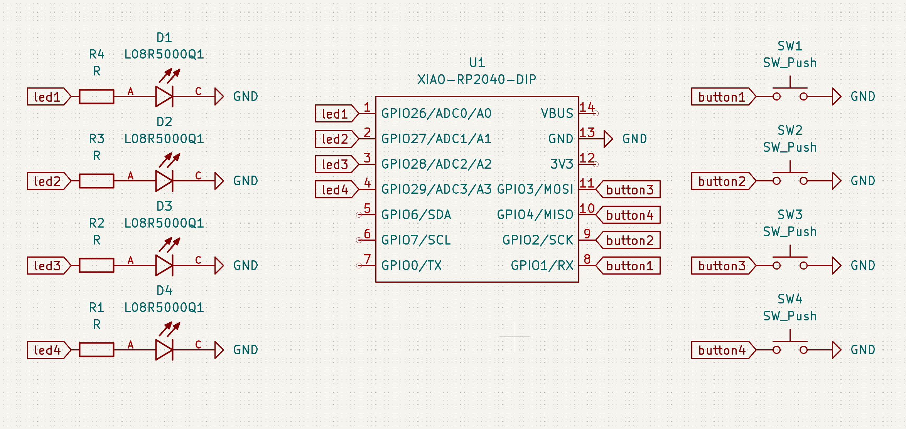

# Pathfinder

I made 2 different game firmwares for this to pass time.

There is not a lot I can do with 4 LEDs and 4 Buttons

## Board Images

### PCB Design

### Schematic

### Assembled Board

## Games

### Memory Game
Starts with 1 and goes up every time you get it correct up to 50 (good luck). Has win, loose, and start animations.

### Whack-a-Mole
Press the buttons with the LEDs as they light up before they go away to score points. Has win and start animations along with showing your score at the end by 4ths (12, 25, 35, 50)

